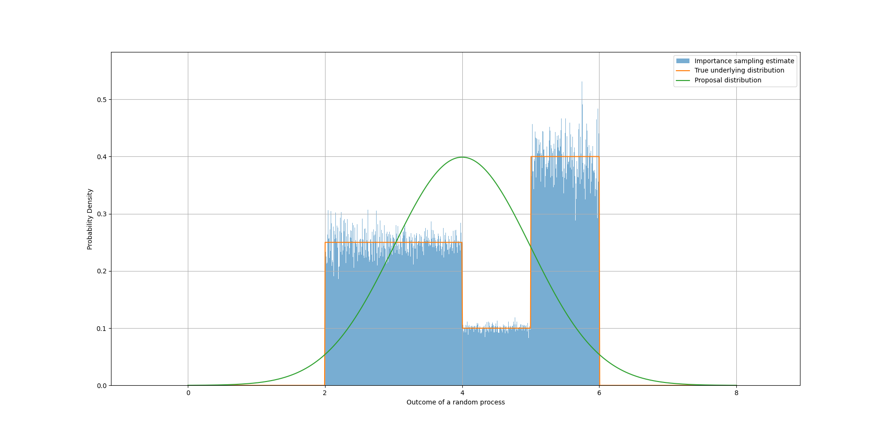
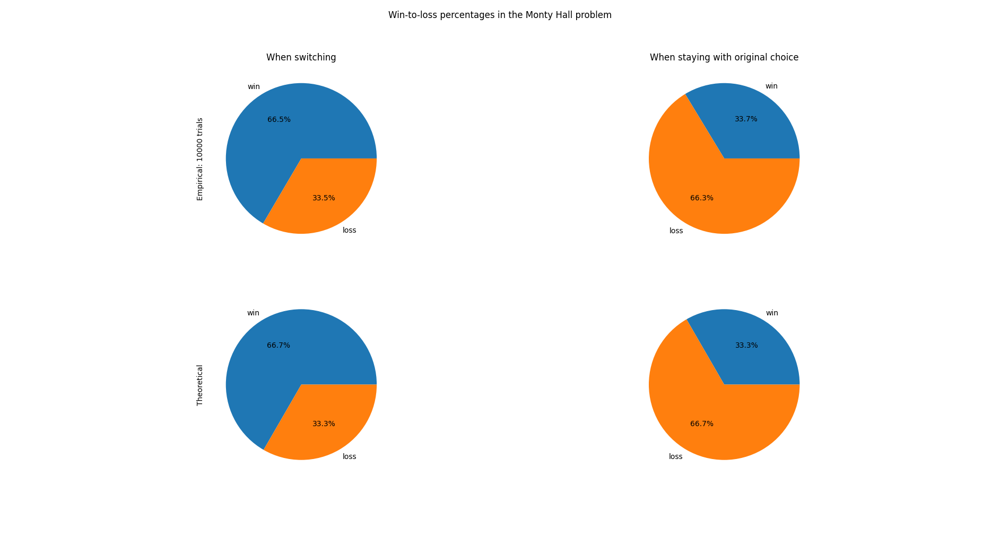

# Probability & Statistics 
A repository containing python implementations and visualisations for fundamental concepts in probability and statistics.

Concepts covered in this repository include: 
- [Importance Sampling](#Importance-Sampling)
- [Monte Hall Problem](#Monte-Hall)

## Importance Sampling

Importance sampling allows you to estimate properties (like expectations) of a difficult-to-sample distribution by instead sampling from an easier, “proposal” distribution.
The figure below illustrates how the posterior distribution was estimated using a Gaussian proposal distribution and importance sampling using 1,000,000 samples:

## Monte Hall

The Monte Hall problem is an interesting problem in probability, where a contestant is asked to pick one of three doors which may contain a prize. Once the contestant has 
selected a door, the host opens one of the other two remaining doors that do not contain the prize and asks the contestant if they would like to change their initial choice. 
The probability question proposed is as follows: does the player changing their selection change their odds? Interestingly, the answer is yes, by 33% in fact. 

The following python implementation creates a Monte Carlo simulation of the Monte-Hall random experiment and compares the strategies:
1. the contestant switches from their initial choice, and
2. the contestant stays with their initial choice.

Additionally, the Python code includes an implementation of the Bayesian calculation, with explanations of each step used to derive the theoretical probabilities of these two strategies. The graph below illustrates the win-loss percentages of both strategies as well as expected percentages given the Bayesian formulation.

